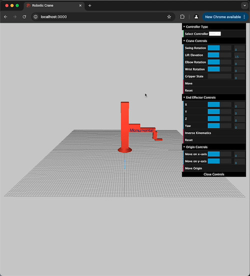
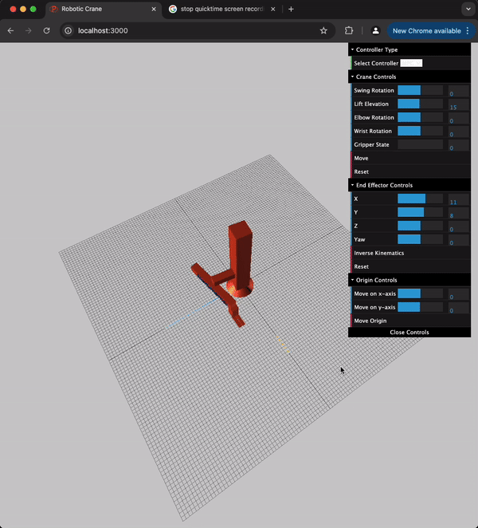
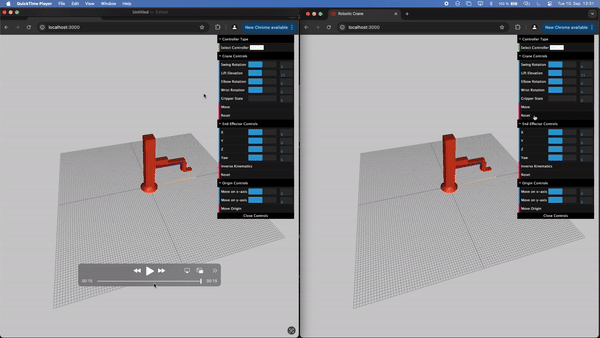

# Robotic Crane - 4 DoF Crane Simulation with 3D Visualization

This project simulates a 4 Degrees of Freedom (DoF) robotic crane, providing real-time 3D visualization using Three.js. It supports actuator state control, inverse kinematics calculations, and movement comparisons with different controllers like PD and MPC. 



## Table of Contents
- [Robotic Crane - 4 DoF Crane Simulation with 3D Visualization](#robotic-crane---4-dof-crane-simulation-with-3d-visualization)
  - [Table of Contents](#table-of-contents)
  - [Features](#features)
  - [Demonstration](#demonstration)
    - [Control Actuator States](#control-actuator-states)
    - [Set 4D Point Using Inverse Kinematics](#set-4d-point-using-inverse-kinematics)
    - [Move Origin with End Effector Stability](#move-origin-with-end-effector-stability)
    - [PD Controller (Left) vs MPC Controller (Right)](#pd-controller-left-vs-mpc-controller-right)
  - [Installation \& Usage](#installation--usage)
    - [1. Clone the Repository](#1-clone-the-repository)
    - [2. Navigate to the Project Directory](#2-navigate-to-the-project-directory)
    - [3. Create the Conda Environment](#3-create-the-conda-environment)
    - [4. Start the Backend Server](#4-start-the-backend-server)
    - [5. Start the Frontend Client](#5-start-the-frontend-client)
    - [6. Access the Application](#6-access-the-application)
  - [Project Structure](#project-structure)
  - [Technologies Used](#technologies-used)
  - [How It Works](#how-it-works)
  - [Future Enhancements](#future-enhancements)

## Features
- **3D Visualization**: Control and visualize the robotic crane in real-time through a Three.js-powered frontend.
- **Actuator Control**: Manually adjust the actuator states to move the crane.
- **Inverse Kinematics**: Input a 4D point, and the crane's end effector will move to it by calculating inverse kinematics.
- **Origin Movement**: Move the crane's origin while keeping the end effector steady.
- **Controller Comparison**: Compare the performance of PD and MPC controllers side-by-side.

## Demonstration
### Control Actuator States


### Set 4D Point Using Inverse Kinematics


### Move Origin with End Effector Stability


### PD Controller (Left) vs MPC Controller (Right)


---

## Installation & Usage

Follow these steps to clone, set up, and run the project:

### 1. Clone the Repository
```bash
git clone https://github.com/phiahr/robotic-crane.git
```

### 2. Navigate to the Project Directory
```bash
cd robotic-crane
```

### 3. Create the Conda Environment
```bash
conda env create -f environment.yml
```

### 4. Start the Backend Server
- Navigate to the backend directory:
  ```bash
  cd backend
  ```
- Start the server using Uvicorn:
  ```bash
  uvicorn main:app --reload
  ```

### 5. Start the Frontend Client
- Open a new terminal window and navigate to the frontend directory:
  ```bash
  cd frontend
  ```
- Run the client:
  ```bash
  pnpm install
  ```
- Run the client:
  ```bash
  pnpm dev
  ```
  or
  ```bash
  npm run dev
  ```

### 6. Access the Application
Open your browser and navigate to:
```
http://localhost:3000
```

Now, you can interact with the robotic crane!

---

## Project Structure

```
├── README.md                       # Project documentation
├── environment.yml                 # Conda environment configuration
├── backend                         # Backend code and logic
│   ├── CraneBot.py                 # Robotic crane core class
│   ├── main.py                     # FastAPI app for backend server
│   ├── MPCController.py            # Model Predictive Controller implementation
│   └── PDController.py             # PD Controller implementation
├── config                          # Configuration files
│   └── crane_config.json           # Crane settings and parameters
├── frontend                        # Frontend code and user interface
│   ├── app                         # Main application and services
│   │   ├── page.tsx                # Main page component
│   │   └── websocketService.ts     # WebSocket client for real-time updates
│   └── components                  # React components for crane visualization and control
│       ├── ControlPanel.tsx        # UI for controlling the crane's actuators
│       ├── Crane.tsx               # 3D visualization of the crane
│       ├── CraneState.ts           # Crane state
│       └── EndEffectorState.ts     # State of the crane's end effector
└── media                           # Media files for demonstrations
```

---

## Technologies Used
- **Backend**: Python, FastAPI, Uvicorn, Cvxpy
- **Frontend**: Typescript, React, Three.js, WebSocket
- **Inverse Kinematics**: Custom algorithm to control crane motion
- **Controllers**: PD Controller and Model Predictive Control (MPC)

---

## How It Works

- **Actuator Control**: Directly manipulate the crane's joints and see the effects in real-time through the 3D interface.
- **Inverse Kinematics**: Calculate the position and orientation of the crane's end effector by solving kinematic equations based on a given 4D point.
- **PD vs MPC**: Compare the behavior of the crane under two different controllers to observe performance differences.

---

## Future Enhancements
- Set slider values to maximum values the gripper could reach
- Deal with edge case of origin being further away from where the end effector can keep its state
- Limit joint rotations
- Improve the 3D visualization with more detailed models.
- Extend functionality to support different types of robotic arms.
